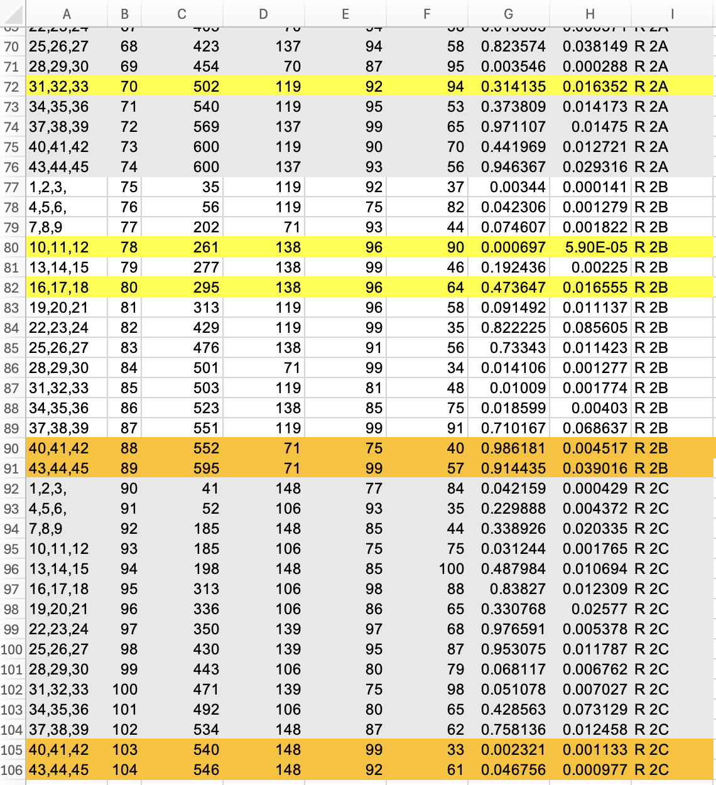

# Experiment- Round Redo

Due to system errors on the robot during data collection, several vials from our last data collection round had inaccurate time readings because they were not picked up and transferred at the indicated times.  Upon reviewing the dataset with experts to verify the chemical reasonableness of the yields found, we discovered that seven conditions yielded contradicting results compared to our other experiments. So we recalled the seven conditions that seemed to contradict.

Figure1: Screen-shot showing outlier highlighted