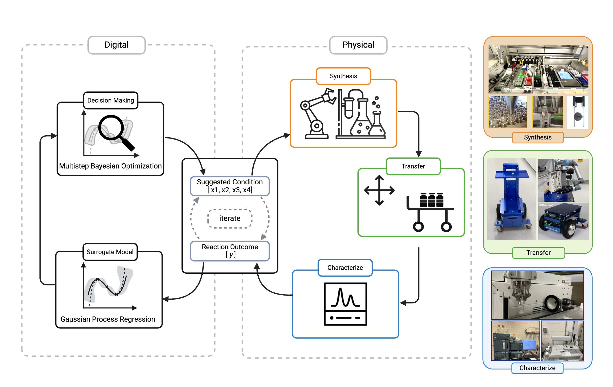
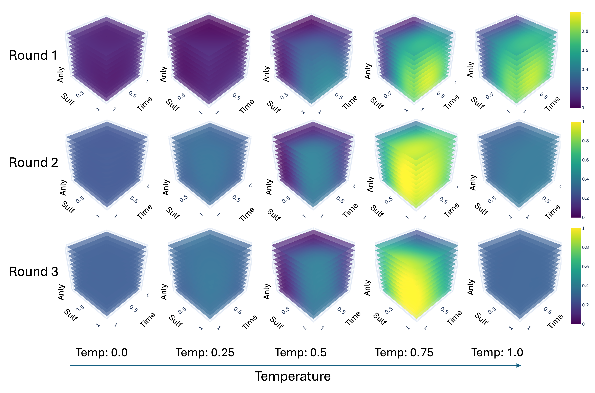
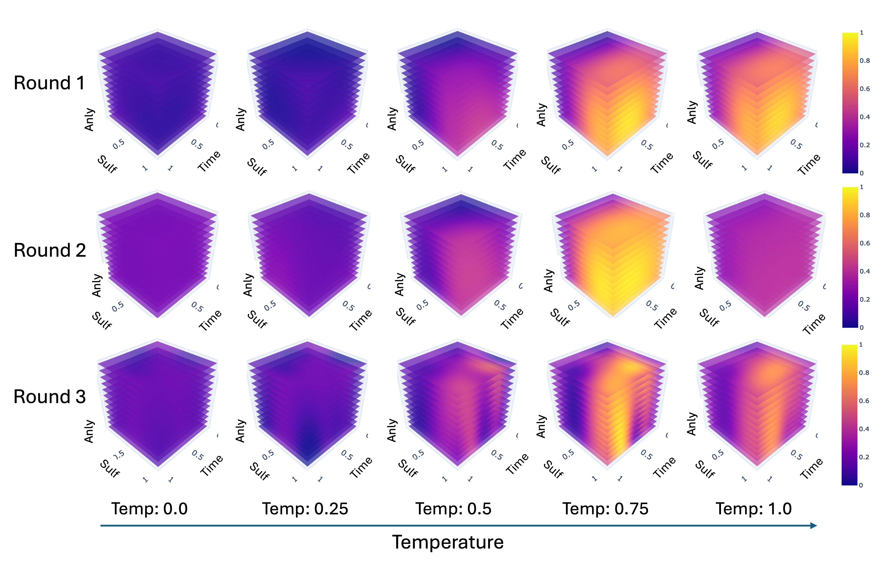
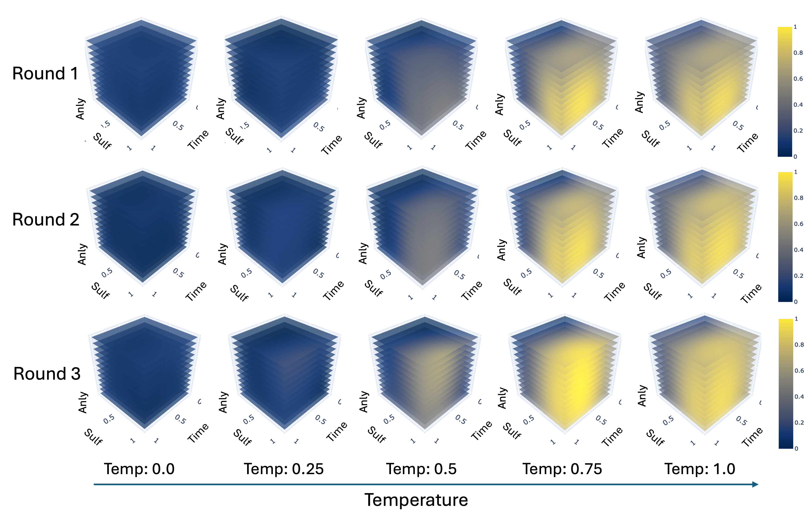
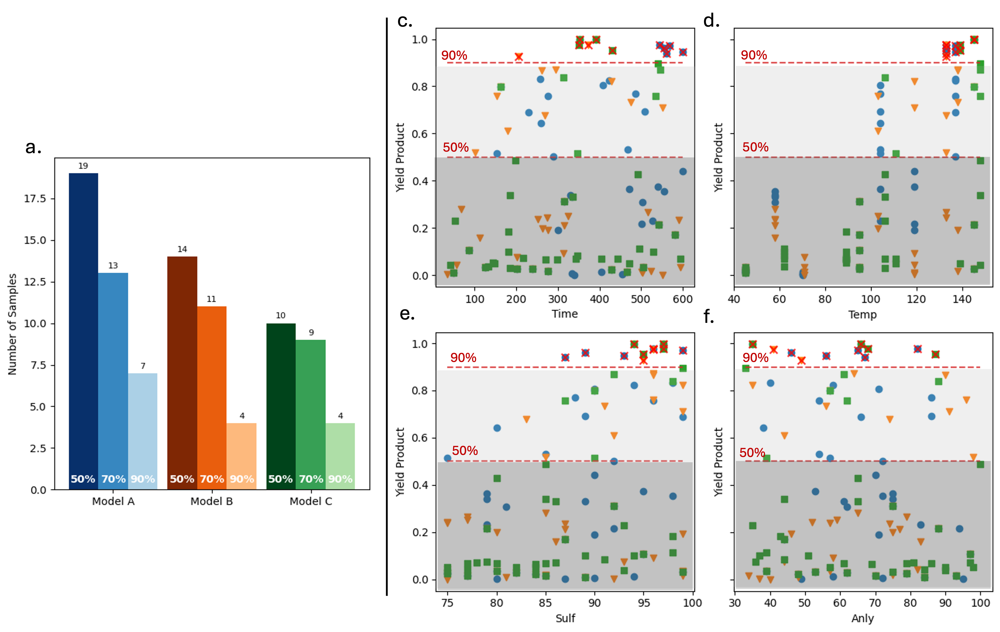

# PNNL-ML_for_Organic_Flow_Battery_Materials
Machine learning guided synthesis for organic flow batteries and the processes.
This repositiory contains the code used for the experiment conducted at PNNl and UW for synthesizing organic redox batteries.



The following figure is a diagram that shows how to files are organized


# Results 
## Model A: 

Plots for Model A can be found under ```Results/ModelA_results.ipynb```
The uncertainty plots for Model A were constructed in the same file. (SI)

## Model B:

Plots for Model B can be found under ```Results/ModelB_results.ipynb```
The uncertainty plots for Model B were constructed in the same file. (SI)

## Model C: 

Plots for Model C can be found under ```Results/ModelC_results.ipynb```
The uncertainty plots for Model C were constructed in the same file. (SI)

## Summary of Results

Model evaluations and comparison plots can be found in ```Results/All_results.ipynb```

# Method
In total, four rounds of data collection were conducted and are denoted: Round1, Round2, Round3, and Round_Redo. 
- Round 1: Contains data generated from Latin Hypercube sampling and their respective HPLC samples. 
- Round 2: Contains the code to extract yield from HPLC and the Bayesian Optimization in round 2 for Model A, Model B, and Model C, as well as their repective HPLC samples. 
- Round 3: Contains the code to extract yield from HPLC and the Bayesian Optimization in round 3 for Model A, Model B, and Model C, as well as their repective HPLC samples. 
- Round Redo: Contains selected samples that were resynthesized due to inconsistencies.