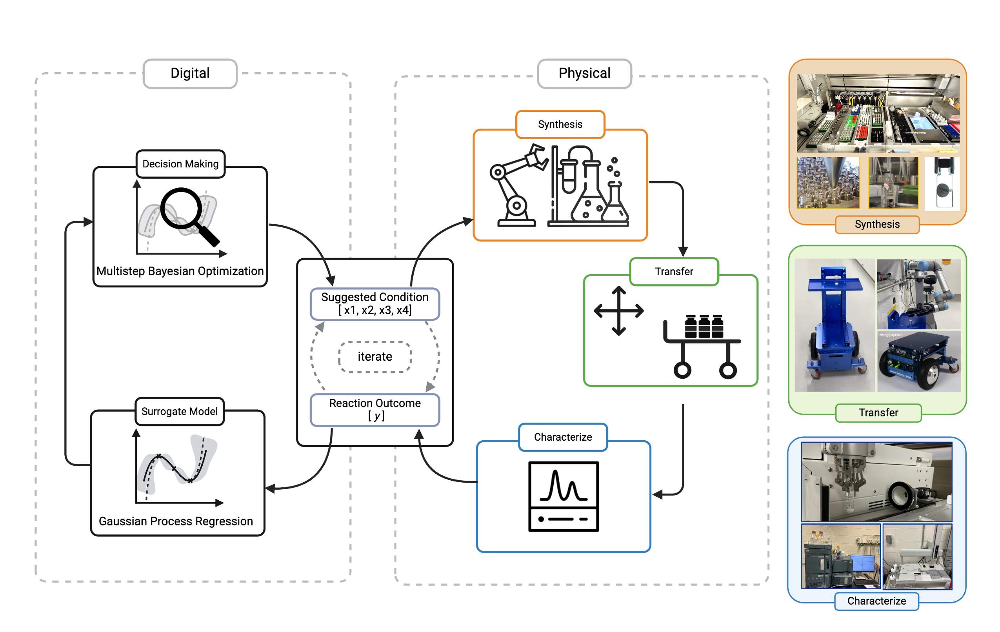
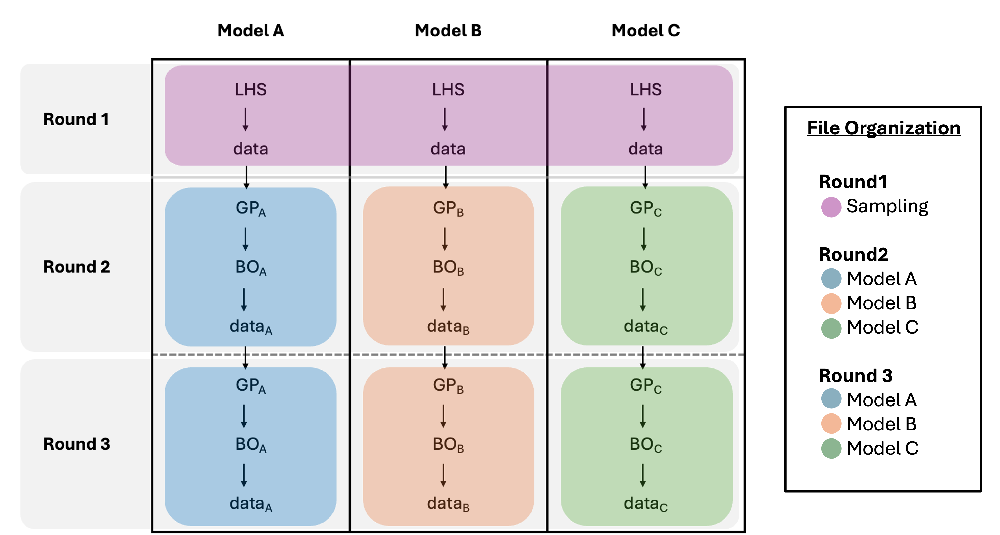

# PNNL-ML_for_Organic_Flow_Battery_Materials
Machine learning guided synthesis for organic flow batteries and the processes.
This repositiory contains the code used for the experiment conducted at PNNl and UW for synthesizing organic redox batteries.

The following figure is a diagram that shows how to files are organized

