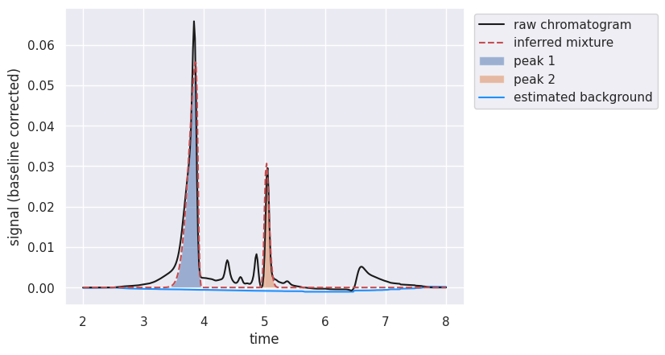
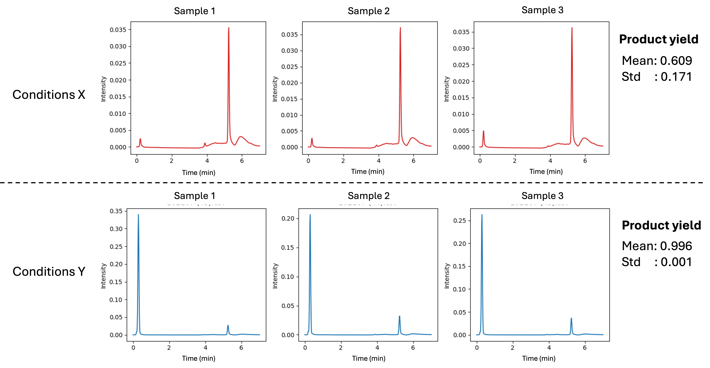

# Autonomous Synthesis of Organic Flow Battery Materials
Machine learning guided synthesis for organic flow batteries and the processes.
This repositiory contains the code used for the experiment conducted at PNNl and UW for synthesizing organic redox batteries.

All code is run on python version 3.9.1


The following figure is a diagram that shows how to files are organized


# Results 
## Model A:
[Open Model A Results Notebook](Experiment_Results/ModelA_results.ipynb)

Plots for Model A can be found under ```Experiment_Results/ModelA_results.ipynb```
The uncertainty plots for Model A were constructed in the same file. (SI)

## Model B:
[Open Model B Results Notebook](Experiment_Results/ModelB_results.ipynb)

Plots for Model B can be found under ```Experiment_Results/ModelB_results.ipynb```
The uncertainty plots for Model B were constructed in the same file. (SI)

## Model C: 
[Open Model C Results Notebook](Experiment_Results/ModelC_results.ipynb)

Plots for Model C can be found under ```Experiment_Results/ModelC_results.ipynb```
The uncertainty plots for Model C were constructed in the same file. (SI)

## Summary of Results
[Open Summary Results Notebook](Experiment_Results/All_results.ipynb)

Model evaluations and comparison plots can be found in ```Experiment_Results/All_results.ipynb```

# Method
In total, four rounds of data collection were conducted and are named: Round1, Round2, Round3, and Round_Redo. 
- [Round 1](Experiment_Round1): Contains data generated from Latin Hypercube sampling and their respective HPLC samples. 
- [Round 2](Experiment_Round2): Contains the code to extract yield from HPLC and the Bayesian Optimization in round 2 for Model A, Model B, and Model C, as well as their repective HPLC samples. 
- [Round 3](Experiment_Round3): Contains the code to extract yield from HPLC and the Bayesian Optimization in round 3 for Model A, Model B, and Model C, as well as their repective HPLC samples. 
- [Round Redo](Experiment_Round_Redo): Contains selected samples that were resynthesized due to inconsistencies.

## Data Extraction
The product yield is extracted form the HPLC data using the python package ```hplc-py``` 

The peaks are first fit to the Chromatogrpam
```
    chrom = Chromatogram(data_df, cols={'time':f'wave{i}', 'signal':f'intensity{i}'})
    chrom.correct_baseline()
    peak_list.append(chrom.fit_peaks(prominence=0.01))
```
The fit produces a dataframe consisting of the peak locations and the area under the cuve at that peak. We locate the peaks of interest and comput the yield.

For our experiment we have three repetes per conditions. The HPLC of two selected conditons are shown in the figure below. The yield mean and variance are computed after extracting each peak individually.


# Pool-based analysis 
[Pool-Based](PoolBased): \
To compare our model results and test their reproducibility, we conducted pool based analysis. 

[Aquisition Function Selection](PoolBased/AcquisitionFunctions): Contains the analysis for the selection of the aqusiiton functions. 
- ```pool_aqu_comparison.ipynb```  is the analysis for frist 15 samples collected from Latin Hypercube Sampling to determine which aquisition to choose. [See file](PoolBased/AcquisitionFunctions/pool_aqu_comparison.ipynb)
- ```pool_aqu_comparison_fulldata.ipynb```is the analysis that shows the best aquisition function for the redox flow battery data set. [See file](PoolBased/AcquisitionFunctions/pool_aqu_comparison_fulldata.ipynb) 

[Pool-based Comparisons](PoolBased/ComparisonTesting): Contains the analysis of the pool based comparisons.
- ```surrogate_comparison.ipynb``` Contains the comparison of differnt surrogate models. [See file](PoolBased/ComparisonTesting/surrogate_comparison.ipynb)
- ```BOvsBBOvsRandom.ipynb``` Contains the comparison of Bayesian optimizaiton with differnet batch sizes. [See file](PoolBased/ComparisonTesting/BOvsBBOvsRandom.ipynb)

[Scalibility testing](PoolBased/ScalabilityTesting/README.md): Contains the analysis for applying our models ot a different and larger data set.